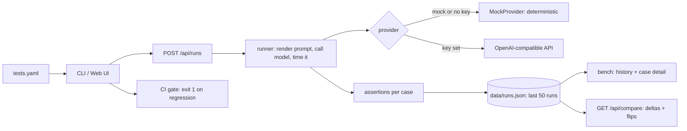

# prompt-regress


Prompts break silently. Someone rewords a system prompt, the model's JSON
changes shape, and downstream parsing fails — while "the AI still answers."
Upgrading a model version flips phrasing in ways no one notices until users
complain. prompt-regress treats prompts like code: define test cases in YAML,
run them against a model, record pass/fail plus cost and latency per case,
diff two runs to see exactly what flipped, and fail CI when anything regresses.

## Quickstart (no API key, mock mode)

```bash
npm install
npm test
npx tsx src/cli.ts --file examples/tests.yaml --model mock
npm run demo:regression
```

The demo runs a baseline suite, then a "regressed" suite where the prompts
were rewritten to sound friendlier, and catches the breakage:

```
baseline : 4/4 passed | $0.00008 | 84ms
regressed: 2/4 passed | $0.00010 | 87ms
delta: pass -2 | cost $0.00003 | latency 3ms

flipped cases:
case           | baseline | target
extract-shape  | true     | false
extract-status | true     | false

REGRESSION CAUGHT: 2 case(s) flipped pass -> fail.
```

To run the web bench:

```bash
npm run build && npm start &          # API on :4000
cd client && npm install && npm run dev   # UI on :5173
```


*(Screenshot placeholder — run the UI locally and save a capture to `docs/bench.png`.)*

## Architecture



Data flow: a suite (YAML or JSON) is validated with a schema, each case's
`{{variables}}` are rendered, the provider is called once per case (serial by
default, `--concurrency` for parallel), deterministic assertions run on the
output, cost is estimated from real usage tokens (or a chars/4 fallback), and
the full run record is stored. Comparing two runs matches cases by ID and
reports pass/cost/latency deltas plus the flipped-case list.

## Suite YAML reference

```yaml
name: "inspection-baseline"   # required
model: "mock"                 # required (mock, gpt-4o-mini, llama3.1, ...)
system: "Reply with JSON only."   # optional system prompt
temperature: 0                # optional, informational
tests:                        # required, non-empty
  - id: "extract-shape"       # required, used to match runs for comparison
    prompt: "Extract {{site}} as JSON."   # {{var}} templating; unknown keys stay as {{key}}
    variables: { site: "Site-A" }         # optional
    expect:                   # assertions, all must pass
      - { type: "json_valid" }
```

### Assertions

| Type | Example | Checks |
|---|---|---|
| `contains` | `{ type: "contains", value: "passed" }` | output includes text (case-insensitive unless `caseSensitive: true`) |
| `not_contains` | `{ type: "not_contains", value: "password" }` | secret/word absent |
| `regex` | `{ type: "regex", pattern: "\"passed\"" }` | pattern matches |
| `equals` | `{ type: "equals", value: "ok" }` | exact match after trim |
| `json_valid` | `{ type: "json_valid" }` | output parses as JSON (fences tolerated) |
| `json_schema` | `{ type: "json_schema", required: ["site"] }` | required keys present |
| `max_latency_ms` | `{ type: "max_latency_ms", ms: 5000 }` | latency budget |
| `llm_judge` | `{ type: "llm_judge", rubric: "is this polite?" }` | second model call grades output PASS/FAIL |

## Providers

No key → everything runs on the deterministic mock provider. With a key, any
OpenAI-compatible endpoint works:

```bash
# OpenAI
$env:OPENAI_API_KEY="sk-..."

# OpenRouter
$env:OPENAI_API_KEY="sk-or-..."
$env:OPENAI_BASE_URL="https://openrouter.ai/api/v1"

# Local Ollama (free)
ollama pull llama3.1 && ollama serve
$env:OPENAI_API_KEY="ollama"
$env:OPENAI_BASE_URL="http://localhost:11434/v1"
```

Requests time out after `PROMPT_REGRESS_TIMEOUT_MS` (default 30s) and retry
twice with backoff on network errors and 429/5xx. Copy `.env.example` to `.env`
for local config (never commit `.env`).

## CLI

```
--file <path>        suite file (default examples/tests.yaml)
--model <name>       override the suite's model
--fail-on-regress    exit 1 when any case fails
--baseline <id|path> compare against a stored run ID, a run-record JSON file,
                     or a suite file (run as baseline)
--report <format>    "markdown" prints a report (pipe to $GITHUB_STEP_SUMMARY)
--concurrency <n>    cases in flight (default 1, serial)
```

Exit codes: `0` pass · `1` regression detected · `2` config/usage error.

## CI usage

The repo's own workflow gates on the mock suite and posts a demo report:

```yaml
- name: regression gate
  run: npx tsx src/cli.ts --file examples/tests.yaml --fail-on-regress --model mock
- name: demo report
  run: npx tsx src/cli.ts --file examples/regressed.yaml --model mock --baseline examples/baseline.yaml --report markdown >> $GITHUB_STEP_SUMMARY || true
```

To gate your own repo's prompts, see the copy-paste job in
[`examples/regression-gate.yml`](examples/regression-gate.yml).

## API

| Method | Route | Notes |
|---|---|---|
| `POST` | `/api/runs` | body `{ suite }` or `{ yaml }`; rate-limited per IP; validates the suite (400 on error) |
| `GET` | `/api/runs` | run summaries |
| `GET` | `/api/runs/:id` | full run detail |
| `GET` | `/api/compare?base=&target=` | deltas + flipped cases |

`POST` bodies are capped at 1mb. No authentication — do not expose the server
publicly with a real API key configured.

## Related tools

[promptfoo](https://github.com/promptfoo/promptfoo) is the established,
feature-rich prompt-evaluation tool (many providers, red-teaming, datasets).
This project is deliberately smaller: a single Express + React codebase you can
read in an afternoon, a CI gate as the headline feature, and a mock provider
so the whole loop works offline. It was built to learn how evaluation harnesses
work, not to compete on features.

## Limitations and next steps

- **LLM-as-judge is biased and inconsistent** — use deterministic assertions by
  default; treat judge verdicts as advisory.
- **Single-shot runs are flaky** — temperature is 0 but models still vary; the
  honest fix is N runs per case with pass-rates, not yet implemented.
- **Serial by default** — `--concurrency` exists but there is no job queue;
  large suites need a worker system.
- **JSON file store won't scale** — fine for one user, capped at 50 runs; a
  team version needs Postgres.
- **Cost is an estimate** — real usage tokens when the API returns them,
  chars/4 fallback otherwise; good for comparison, not billing.
- **No auth on the API** — anyone with network access can run suites on your key.

## Contributing

```bash
npm install
npm test          # 57 tests, must stay green
npm run build     # TypeScript strict, must compile
```

One commit per change, clear messages. Never commit secrets or `.env`.
`GUIDE.local.md` (if present) is a personal file and stays uncommitted.

## License

MIT — see [LICENSE](LICENSE).
